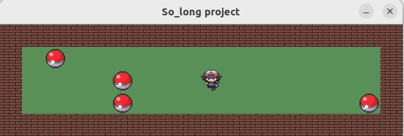
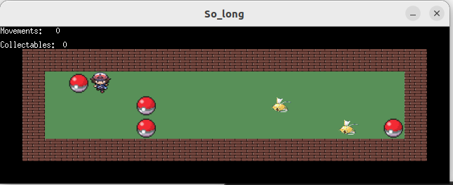

<h1 align="center">
	So Long project
</h1>
<p align="center">
	This project helped you? Give it a 🌟!
</p>

## 🕹️ General information
Bonus included.</br>
A complete and straightforward implementation of So Long 42 project.</br>

so_long is a project from the 42 school curriculum that involves creating a simple 2D game using the MiniLibX library. The objective of the project is to create a small game where a player can move around a map, collect items, and reach an exit to win. This project helps students get familiar with game development concepts, graphics programming, and event handling in C.

## Project Description
In the so_long project, you will create a basic 2D game with the following requirements:

The game map is made of walls, empty spaces, collectibles, a player, and an exit.
The player can move up, down, left, and right.
The player collects all collectibles and reaches the exit to win.
The game displays the number of movements the player has made.
The project is implemented using the MiniLibX library, which provides simple functions to create windows, draw images, and handle user inputs.


## 🎛️ Features
- 32-frame tiles animations for movements in all four directions.
- A move counter displayed in the terminal.
- 2D game map
- Collectibles

## Usage
To run the game, execute the compiled binary with a map file as an argument:

```sh
make
./so_long maps/*.ber
```
You can create your own maps or use the sample maps provided in the maps directory.
A valid map file has the .ber extension and follows specific formatting rules, such as:
- The map must contain 1 exit, at least 1 collectible, and 1 starting position to be valid.
- The map must be rectangular.
- The map must be closed/surrounded by walls. If it’s not, the program must return an error.
- You have to check if there’s a valid path in the map (`flood fill` algorithm).
- You must be able to parse any kind of map, as long as it respects the above rules.

## Controls
- `W` or `↑`: Move up
- `A` or `←`: Move left
- `S` or `↓`: Move down
- `D` or `→`: Move right
- `ESC`: Exit the game

## Map example

- Starting game:



- Ending game:


## 🏅 Bonus Features
- Implementation of static enemy patrols and 3 sprites as well for the enemies.
- A move counter and number of caught collectibles above the game screen.
- Player loses if they touch the static enemy.

## Usage

To run the game with the above mentioned bonuses, execute the compiled binary with a map file as an argument:
```sh
make bonus
./so_long_bonus maps/*.ber
```

## Map example

- Starting game:



- Ending game:


## 🏷 Credits
This project is part of the 42 school curriculum. It was developed using the MiniLibX library. Special thanks to the 42 community for their support and resources.

For more information about the project requirements, visit the 42 Project Page, since this subject could change.